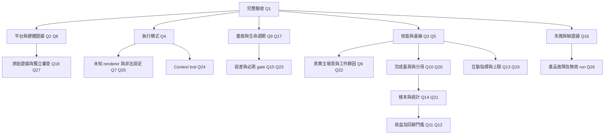

# Chapter 13：GPU Acceleration 驗證研究

查證日期：2026-10-05。目標環境：Linux／WSL2／WSLg。本文最初是實作前的驗證設計；當時沒有啟動 Tai Gar、執行 GPU 畫面測試、安裝工具或修改系統設定。後續實作與實測見 [結果報告](chapter-13-gpu-verification-results.md)。

2026-10-05 使用者修訂：**取消 CPU raster／draw 至少佔有效工作時間 50% 的資格門檻**。
CPU 繪圖佔比改為瓶頸歸因資訊，數值高低不阻止正式量測、freeze 或結果分析，也不作為排除場景／run 的理由。
可見內容變動、實際重新 raster、固定公平工作量、畫面正確性、完成邊界與原始資料完整性仍須核對。
以下量測契約已同步採用此修訂；原始 v1 證據保留歷史規則與判定。

## 設計訪談：已確認決策與完成狀態

2026-10-05，`grill-with-docs` 共四輪、27 項建議均獲使用者確認。設計問題已逐項定案，尚待使用者對整體共同理解作最後確認；本輪交付是驗收設計文件，沒有實作工具或執行 GPU 驗收。

| 訪談決策 | 已確認契約 | 記錄位置 |
| --- | --- | --- |
| Q1–Q3：交付、平台、退步 | 三項 PASS 才完整結案；任一目標平台可驗收，結論限定該平台；其他代表場景也須過關 | [ADR 0001](adr/0001-platform-scoped-gpu-acceptance.md)、第 5.1 節 |
| Q4、Q7、Q25：執行模式 | 一般 GL 模式允許明示的 software／unknown；嚴格模式拒絕，unknown 為 PENDING；非法設定或初始化失敗不默默 fallback | [ADR 0002](adr/0002-gpu-backend-software-gl-policy.md)、第 4 節 |
| Q5、Q6、Q22：基線與負載 | CPU sync／GPU sync 衡量 backend 收益；GPU sync／CPU threaded 檢查產品退步；固定一個真實瀏覽器文字＋矩形綜合主場景；繪圖佔比只作歸因，不設最低值 | [ADR 0003](adr/0003-gpu-performance-baselines.md)、第 5 節 |
| Q8、Q18、Q27：證據與審查 | L3 原始資料可歸因到程序／context；保存完整證據包；獨立 reviewer 能重算與核對 | 第 4 節、第 5.3 節 |
| Q9、Q15、Q17、Q23：正確性與生命週期 | 分區容差先校準凍結、負例必須被拒絕；所有必測操作未完成就保持 PENDING | 第 5.2 節 |
| Q10、Q20：完成量測 | renderer 吞吐包含 raster／composition、必要像素準備、提交及批次尾完成等待，present 呼叫及等待在分母外；正常互動與 GL query 分開跑 | 第 5.1 節 |
| Q11、Q12、Q13、Q19：數值與邊界 | 主吞吐 CI 下界 > 1.10，回歸下界 ≥ 0.95；產品 p95 延遲容許增幅 max(2 ms, 基線的 10%)；不宣稱 input-to-visible | 第 5.1 節 |
| Q14、Q21：樣本與統計 | 至少 10 組三配置 runs、60 暖機／300 正式 frame；配對幾何平均與雙側 95% bootstrap，10,000 次重抽 | 第 5.1 節 |
| Q16、Q24、Q26：失敗處置 | 有效實驗未達標及產品 crash／卡死／漏工作為 FAIL；量測故障為 PENDING；context lost 停止 GPU 程序並清理 | 第 5.4 節、[ADR 0004](adr/0004-gpu-context-loss-stop-policy.md) |

用語見 [CONTEXT.md](../CONTEXT.md)。以下是已確認的專案契約，不能當成 library 保證或已通過驗收的結果。實作時仍須取得可觀測的硬體主機、校準容差、凍結場景 manifest 與完成原始量測；它們是執行工作及資料產物，不是未回答的設計問題。



## 1. 先分清楚要證明的三件事

1. **程式走 OpenGL 路徑**：SDL 建立 GL context，Skia 使用 Ganesh OpenGL backend，畫面經 GL swap 呈現。
2. **繪圖由實體 GPU 執行**：上述 GL implementation 連到硬體 driver，而且該程序的實際繪圖工作可對應到 OS／driver 的 GPU 活動。
3. **GPU 版本帶來收益**：相同內容、畫面尺寸與執行模式下，降低 frame time、CPU 成本或卡頓，並維持畫面正確。

這三件事須分開報告。OpenGL context、`GrDirectContext.MakeGL()`、`backend="gpu"`、成功 swap 或 timer query 有數值，都不足以單獨證明第 2 點；第 2 點成立也不保證所有頁面都能達到第 3 點。

## 2. 官方資料提供的判讀依據

- `GL_VENDOR`、`GL_RENDERER`、`GL_VERSION` 描述目前 GL connection；讀取位置應是 Tai Gar 自己 current 的 context。Vendor 名稱代表 implementation 提供者，不能只靠它判定硬體廠牌。[Khronos glGetString 官方原始文件](https://raw.githubusercontent.com/KhronosGroup/OpenGL-Refpages/main/gl4/glGetString.xml)
- Mesa 明列 LLVMpipe、Softpipe 為 software drivers；LLVMpipe 使用 CPU 執行 raster 與 shader，可多執行緒運作。因此 OpenGL 功能完備仍可能全在 CPU 執行。[Mesa Platforms and Drivers](https://docs.mesa3d.org/systems.html)、[Mesa LLVMpipe](https://docs.mesa3d.org/drivers/llvmpipe.html)
- Mesa D3D12 driver 將 GL 工作轉成 Direct3D 12；WSLg 需要適合的 Windows GPU driver 與 distro 的 Mesa D3D12 支援。`D3D12 (具體 GPU 名稱)` 是預期硬體線索；`Microsoft Corporation` 作為 GL vendor 可以正常。[Mesa D3D12](https://docs.mesa3d.org/drivers/d3d12.html)、[Microsoft WSLg GPU selection](https://github.com/microsoft/wslg/wiki/GPU-selection-in-WSLg)、[Microsoft WSL GUI prerequisites](https://learn.microsoft.com/en-us/windows/wsl/tutorials/gui-apps)
- Skia surface 可存在 CPU 或 GPU memory；`recordingContext()` 有助識別 Ganesh surface，context 的 `backend()` 回報 underlying 3D API。GPU backend handle 證明資源屬於該 API，仍須另查 driver。[Skia SkSurface](https://api.skia.org/classSkSurface.html)、[skia-python GrDirectContext](https://kyamagu.github.io/skia-python/reference/skia.GrDirectContext.html)
- GL time query 測量命令完成的 elapsed time，以 ns 表示；應確認 counter bits 有效，並在後續 frame 非阻塞取得 64-bit 結果。API 沒有要求 implementation 必須使用實體 GPU。[Khronos ARB_timer_query](https://registry.khronos.org/OpenGL/extensions/ARB/ARB_timer_query.txt)
- `glFlush()` 可在工作尚未完成時返回；`glFinish()` 會等待先前工作完成。把 finish 放每幀會增加同步，因此只留給明確標示的同步診斷。[Khronos glFlush](https://raw.githubusercontent.com/KhronosGroup/OpenGL-Refpages/main/gl4/glFlush.xml)、[Khronos glFinish](https://raw.githubusercontent.com/KhronosGroup/OpenGL-Refpages/main/gl4/glFinish.xml)
- Windows Task Manager 的 GPU／GPU engine counters 來自 GPU scheduler 和 memory manager，支援不同 graphics APIs，也提供按程序的資訊。單看全機利用率不足以歸因 Tai Gar。[Microsoft GPUs in Task Manager](https://devblogs.microsoft.com/directx/gpus-in-the-task-manager/)
- apitrace 可錄 GL calls、檢視 framebuffer 與 textures、replay 及 profiling；GLX／EGL 須選對 tracing API。replay 使用的是重播時的 renderer，不等於原程序的硬體執行證據。[apitrace 官方網站](https://apitrace.github.io/)、[apitrace 官方操作文件](https://github.com/apitrace/apitrace/blob/master/docs/USAGE.markdown)

以下分層、門檻、測試矩陣與產物格式是本專案經訪談確認的驗收契約；官方資料提供 API 語意，專案決定交付與量測門檻。

## 3. 本輪取得的本地資訊與限制

| 項目 | 本輪觀察 | 可作的判斷 |
| --- | --- | --- |
| Kernel | `6.18.40.1-microsoft-standard-WSL2` | 當前環境是 WSL2 kernel |
| `/mnt/wslg` | sandbox 中存在 | 可見 WSLg 目錄；不代表 hardware renderer 可用 |
| `/dev/dxg` | sandbox 中不存在 | 僅是 sandbox 的可見性結果；尚未用 host 診斷確認，不能推論 Windows 沒有 GPU |
| Python packages | skia-python `144.0.post2`；PySDL2 `0.9.17`；PyOpenGL `3.1.10` | 查詢版本與 API 存在性，未建立 rendering context |
| 工具 | `glxinfo` 已有；`apitrace`、`nvidia-smi` 未在 PATH | 不應把未安裝工具當成功驗證 |
| sandbox 的 `glxinfo -B` | `unable to open display :0` | sandbox 無法讀此 display，不是 renderer 判定 |
| 經批准於 sandbox 外重跑 `glxinfo -B` | `GL_RENDERER=llvmpipe (LLVM 20.1.2, 256 bits)`；Mesa `25.2.8`；`Accelerated: no`；`direct rendering: Yes` | 該 `:0` GLX 探測 context 使用 software renderer；`direct rendering: Yes` 不等於硬體 |

`glxinfo` 是另一個程序。Tai Gar 尚未啟動，可能使用不同 SDL video driver 或 context，因此**目前尚不能宣稱 Tai Gar 使用硬體 GPU，也不能把 glxinfo 結果當成其最終 actual-context 判定**。後續須取得 Tai Gar 的 L1～L3 證據。現有 software 線索必須寫入驗收報告，不能當 hardware PASS。

本輪以本地 binding 查詢確認 `Surface.recordingContext`、`getBackendTexture`、`getBackendRenderTarget`，以及 `GrDirectContext.backend`、`flushAndSubmit`、`submit`、`abandoned` 均存在。這是 API availability，不是渲染測試。

工作目錄目前 POC 的 `browser.py` 已在 SDL GL context current 後印出 GL vendor／renderer／version，也有 GPU surface 與 swap 路徑；本輪 read-only 搜尋沒有找到 `GL_TIME_ELAPSED` 或 backend-resource evidence 檢查。須以後續 implementation diff 確認實際新增項目。

設計訪談另以唯讀程式核對確認：目前 `browser.trace` 的 `pid` 固定為 `1`，thread ID 是 Python thread identity，並非可直接用於 OS 歸因的完整身份契約；`raster_id` 表示窗口，`scene_epoch` 表示場景世代，尚無逐幀唯一身份。因此不能直接拿現有 trace 完成 L3 對照。現有 `sync` 指 Browser Thread inline raster，不表示 CPU 等待 GPU 完成；`raster_and_draw` 的 elapsed 是 CPU wall time。這些均未經 GPU 實測。

現有 `input_dispatch_latency` 只量 SDL event timestamp 到 Browser 開始 dispatch 的時間，在 handler、Main Thread task、raster 與 present 之前；不能當作 input-to-visible 或完整互動延遲。固定本地動態場景須沿用目前支援的外部 script 載入、RAF callback 與整個 style 字串的設定方式，不能預設未支援的 inline script、RAF timestamp 或 `node.style.opacity` API 已存在。

唯讀核對也確認：tab raster cache 的 interest region 有界，區域外 display commands 會被跳過，未跨 cache 邊界的 scroll 可只重用 surface。主場景不能只用 DOM 數量或 RAF callback 次數代表實際 raster 工作。字型由系統解析，目前未保存實際 font 檔案與雜湊；未來 manifest 應保存 resolved font 身分，而非只有 requested family。現有窗口 event handler 尚無最小化／DPI／context lost 分支，navigation generation 也尚未進入 raster work／result 契約；這些是待實作限制，沒有做 runtime 驗證。

目前非法 `BROWSER_RENDER_BACKEND` 值會默默變成 CPU，非法 raster mode 會變成 threaded，與已確認的非法設定報錯政策不符，須在實作時修正並保存原始 requested 值。GPU＋threaded 已明確拒絕；這不表示其他設定與失敗分支已符合契約。

## 4. L0～L4 證據與判定

| 層級 | 本專案要保存的證據 | PASS 條件 | FAIL／PENDING 條件 |
| --- | --- | --- | --- |
| L0：backend 選擇 | 原始 requested／actual backend、配置錯誤原因、PID、window ID、thread ID、context ID、run ID | actual 使用 GL／Skia 路徑；真實 frame 呈現且配置符合契約 | 默默 CPU fallback 或有效配置下產品未完成要求的工作：FAIL；缺少可觀測資料：PENDING |
| L1：actual driver | Tai Gar current context 的 vendor／renderer／version、SDL video driver、Mesa／driver 版本、Windows adapter 名稱 | hardware renderer／adapter 可識別，與 host 資訊一致 | llvmpipe／softpipe／已知 software adapter：hardware FAIL；不明 renderer 或只有 glxinfo：PENDING |
| L2：Skia GL execution | context backend、surface recording context、valid backend render target／texture、frame IDs、GL draw／submit／swap evidence、畫面結果 | 同一窗口與 context 中有真實 Skia GL 繪圖並呈現；正常 frame 無 CPU readback | 只有 context 初始化、只有 CPU pixels upload 或只有空 swap：FAIL；沒有 call evidence：PENDING |
| L3：OS 程序關聯 | 同 run ID 的時間標記、GPU engine／adapter、程序或 context 對應、idle／rendering／pause 的活動變化 | 能把實際繪圖時間與 hardware GPU 工作合理對應；排除 compositor／其他程序 | 只有全機 GPU% 或 WSL 聚合值：證據不足／PENDING；查不到 counter：PENDING，不直接宣告 software |
| L4：公平 benchmark | 固定 workload 的原始 frames、CPU time、可用時的 GL query time、present time、p50／p95／p99、設定與版本 | 畫面正確，主要收益與每個回歸／產品退步門檻均通過 | 有效完整實驗未達門檻：performance FAIL，表示未證明要求的改善；缺資料、設定不一致、clock 不同未對齊：PENDING；畫面錯誤：FAIL |

驗收輸出至少分成 `gl_path_status`、`hardware_status`、`performance_status`，各自使用 PASS／FAIL／PENDING。**L0／L2 可以 PASS，hardware 仍 FAIL 或 PENDING。**單元測試 PASS 只表示程式契約，不能升級 hardware status。

完整 `gl_path_status` 還包含第 5.2 節的畫面與必測生命週期 gate；只有 L0／L2 的首幀證據不足以讓完整 GL 驗收 PASS。software GL 的效能資料可以如實分析，但只能描述 software GL backend 的收益，不能宣稱實體 GPU 收益。負例的測試斷言可 PASS，該負例 run 的 hardware 結果仍為 FAIL 或 PENDING，兩者分開保存。

L1 硬體線索加 L2 真實 GL draws 才能證明命令走向預期 renderer；本專案將 L3 作為完整硬體驗收的獨立佐證。WSL 聚合 counter 無法分辨 browser raster 與 compositor 的情況須保留不足判定，改用可歸因程序／context 的 OS／driver trace 或在可觀察的硬體主機重新驗收。

### L1：renderer 分類與可控負例

規劃辨識已知 software names，例如 llvmpipe、softpipe、Software Rasterizer、SwiftShader、Microsoft Basic Render Driver／WARP。未知名稱不能用「沒在 denylist」直接判 hardware PASS。Integrated Intel／AMD GPU 也屬硬體 GPU，不必要求離散顯卡。

已確認提供嚴格驗證模式：若 `requested=gpu` 卻得到 software renderer，停止並保存清楚的診斷結果，hardware 為 FAIL；unknown renderer 也停止並保存診斷，但 hardware 為 PENDING。一般執行模式允許 software GL 與 unknown，但 UI／log 必須如實標示，不能宣稱 hardware acceleration。

未指定 backend 時預設 CPU；明確指定非法 backend／raster mode、GPU＋threaded 或 GPU 初始化失敗均報錯並保存原始設定與原因，不默默改走 CPU。一般模式允許 software GL 是仍走 GL backend，不是 CPU backend fallback。硬體候選通過啟動分類也仍須取得 L2／L3，不能直接升為 hardware PASS。

可用 Mesa `LIBGL_ALWAYS_SOFTWARE=true` 加 `GALLIUM_DRIVER=llvmpipe` 做負例；必須再讀 actual renderer，確認 override 生效，嚴格模式應拒絕此情況。[Mesa environment variables](https://docs.mesa3d.org/envvars.html)

### L2：surface 與真實 frame 的交叉檢查

- 各窗口 current context 應匹配其 SDL window／context／owner thread，並保留與 resource evidence 相同的 frame ID。
- Ganesh context backend 預期是 OpenGL；每個 GPU surface 的 `recordingContext()` 應有相符 context。
- 根視窗可能只有 framebuffer render target，沒有 texture；不能要求所有 surface 的 `getBackendTexture().isValid()` 都為 true。根視窗 framebuffer `0` 是正常 default framebuffer，不能因 handle 為 0 就判 invalid。
- tab／chrome offscreen cache 檢查 render target／texture validity。backend handle 的生命週期限制要尊重，只儲存診斷值，不在 surface 重畫／釋放後持續當成可用 resource。
- 使用 deterministic 矩形／文字／混色 workload，證明畫面改變，trace 中有對應 Skia GL draws，且 submit／swap 隨 frame 進行。
- 正常 GPU frame 禁止以 `readPixels`、`toarray`、完整 CPU buffer 或 SDL software blit 呈現。CPU 圖片 decode 與一次性 texture upload 可以存在；「GL upload CPU 畫完的整張畫面」不滿足 GPU raster 目標。
- Screenshot correctness 可以用另外的 capture run，允許明確標示的 GPU readback；benchmark run 必須關閉此 capture。

### GL query 的正確使用範圍

GL query 是獨立診斷 run 的 capability-gated instrumentation，不加入主要吞吐 gate 的正式 run。確認版本／extension、entry points 與 `GL_QUERY_COUNTER_BITS > 0`。[Khronos query counter bits](https://raw.githubusercontent.com/KhronosGroup/OpenGL-Refpages/main/gl4/glGetQueryiv.xml) 使用 query ring，先包住實際 raster／draw，再在 `glEndQuery` 前 flush／submit Skia 命令。Skia 的 drawing 可能先被 deferred，若 query 只包 Python `canvas` calls、GL 工作卻在區間外 submit，測得的是錯的範圍。

後續 frame 先查 `GL_QUERY_RESULT_AVAILABLE`；可用才讀 `glGetQueryObjectui64v(..., GL_QUERY_RESULT)`，以 ns 保存。[Khronos query 結果查詢](https://raw.githubusercontent.com/KhronosGroup/OpenGL-Refpages/main/gl4/glGetQueryObject.xml) 未就緒先保留 pending，設定有界排隊與結束時的回收期限，避免卡住每幀。GL time elapsed 是 GL execution 區間，不是精確的 GPU 忙碌百分比，也不包含所有 compositor／display 成本。

`GrDirectContext.flushAndSubmit()` 的預設是 CPU 不等待；`submit()` 提交成功也不表示 GPU 已完成。診斷可以在獨立模式做 CPU 同步，但不要把同步方式混進 production throughput。[skia-python GrDirectContext submission](https://kyamagu.github.io/skia-python/reference/skia.GrDirectContext.html#skia.GrDirectContext.submit)

query 不支援時 hardware 結論仍可使用 L1＋L2＋L3，但 query-based GPU 時間標記 PENDING／UNAVAILABLE，不能填 0 或用 Python stopwatch 冒充。只要主要完成量測與所有必需指標有效，缺少 optional query 不會單獨阻止 performance PASS。反過來，software GL 也可提供 query 結果，因此 query 非零不提升 L1／L3。

批次完成等待只能涵蓋已送到該 GL context 的命令；計時前須排空暖機工作，計時區間內須 flush／submit 最後一批 Skia 命令，再在同一 current context 等待 GL 完成，尾等待納入完成吞吐。這是依提交與 GL 完成語意推導的量測設計，不涵蓋 desktop compositor 或 display scanout。[Skia submit](https://kyamagu.github.io/skia-python/reference/skia.GrDirectContext.html#skia.GrDirectContext.submit)、[Khronos glFinish](https://raw.githubusercontent.com/KhronosGroup/OpenGL-Refpages/main/gl4/glFinish.xml)

### L3：WSLg 的觀察方式

人工驗收可以在 Windows Task Manager 開 GPU、GPU engine 與 Details counters；記錄 adapter 與相關程序，對照 Tai Gar PID／窗口／run ID 的開始、暫停、恢復時間。

測試分為 idle、持續重畫、暫停、恢復；另跑 CPU 版本與 software GL 負例。關閉其他 GPU 密集程序並保存 control 的曲線。CPU 版本透過桌面 compositor 也可能引發 GPU 活動，所以重點是能對應 raster 工作，不是要求 CPU 模式 GPU 利用率為 0。

若 Windows 只提供 WSL／system process 聚合資訊，報告必須明示 attribution 的限制。無法把 GPU 活動對到該 GL context 時，不把 L3 設 PASS；必要時使用 OS／driver 專用 trace 或在原生 Linux 的可觀察 hardware 環境補驗。本文不承諾 Task Manager 能在所有 WSL 版本直接顯示 Linux `python3` 的個別 PID。

## 5. benchmark 必須控制的條件

已確認跑三組：`CPU + sync`、`GPU + sync`、`CPU + threaded`。第一與第二組用來隔離 rendering backend 差異；第三組提供目前產品基線，GPU sync 相對它的退步也納入驗收。不能只拿 CPU threaded 對 GPU sync 的數字宣稱純 GPU speedup。

固定本地頁面、frame 數、animation／scroll 序列、DOM、draw commands、實際解析的字型、窗口與 drawable pixel size、DPI、MSAA／stencil／color format、cache 策略、背景程序與電源狀態。每個場景預熱後收樣，至少 10 組獨立 runs，每組包含三種配置並預先隨機化順序。先做畫面對照，再進行無 screenshot／readback／apitrace 的正式 timing。

分開保存 Python raster／draw／submit 的 CPU wall time、process CPU time、可用時的 GL elapsed time、SDL swap wall time、應用程式呈現延遲與幀間隔。只有 GPU submission 變快，不能直接宣稱 frame rendering completion 同比例變快，也不將 swap 返回當作螢幕可見。

記錄並讀回 SDL swap interval，而非只記錄 requested value；vsync 為 1 時 fps 可能受 refresh cap，兩者同為 60 fps 仍可有 CPU／p95 改善。分析 GPU render throughput 時可以另作 vsync 關閉的診斷，但也要另記 browser animation scheduler 的幀率上限與實際測得的 frames。不要修改 WSLg 設定來掩蓋限制。

Microsoft 官方指出 WSLg 的 Linux compositor 與 Windows compositor 可能使 application fps 與人眼所見不同；本文將 refresh rate 與 presentation 分開記錄，不假定文件中的歷史預設值仍適用當前主機。[Microsoft Controlling WSLg frame rate](https://github.com/microsoft/wslg/wiki/Controlling-WSLg-frame-rate)

WSLg 官方 README 記錄過 GPU／compositor interop 經 system memory 的路徑；實際傳輸成本依主機版本查證。因此 Tai Gar 內消除 CPU readback，不代表整條 WSLg presentation pipeline 都無拷貝。[Microsoft WSLg rendering architecture](https://github.com/microsoft/wslg#opengl-accelerated-rendering-in-wslg)

已確認以固定本地 Tai Gar 頁面的一個文字＋矩形綜合場景作主要收益驗收，並納入小頁面、透明度／裁切、捲動／RAF 回歸場景。正式量測前凍結場景規模與 manifest；有效工作檢查須證明可見內容改變與實際重新 raster。CPU 基線的 raster／draw 佔有效工作時間比例須保存原始 timings 與歸因方式，排除 idle 與 present 等待；**佔比高低不設門檻，僅用於解釋瓶頸與整體收益，不作量測資格、freeze、通過或樣本排除條件**。原始歸因資料仍須完整、可重算且數值有效；缺漏或被竄改屬資料完整性問題，不是低佔比不合格。低佔比場景照常進行 CPU／GPU 比較，無改善或退步也完整報告；不得為提高佔比或改善正式速度結果挑選工作量。有效工作或畫面校準證據未完成仍不開始正式驗收。Skia 微基準只供診斷，不取代瀏覽器驗收。

以下門檻同步至[主實作計畫第 5.4 節](chapter-13-gpu-acceleration-plan.md#54-l4公平量測分清提交與完成)，是專案驗收契約，不是 library 保證。

### 5.1 已確認的量測契約

| 項目 | 已確認要求 |
| --- | --- |
| 主要 backend 收益 | 主要場景完成吞吐速度比 = GPU sync throughput / CPU sync throughput；run-level 95% CI 下界 **> 1.10** |
| 其他場景 backend 回歸 | 每個回歸場景的 GPU sync / CPU sync 完成吞吐比，95% CI 下界 **≥ 0.95**；逐場景判定 |
| 產品互動指標 | 輸入事件到首個包含其效果的 frame 之 present call 返回；每個互動場景的 GPU sync 相對 CPU threaded 之 p95 增幅 ≤ max(2 ms, CPU threaded p95 的 10%)，配對 run 的 CI 上界也須符合 |
| 樣本與順序 | 每場景至少 10 組獨立 runs，每組三種配置；預先固定並保存隨機化順序 |
| 每次 run | 至少 60 個實際暖機 frame，至少 300 個正式 frame；每個互動 run 至少 100 個可歸因輸入；確切數量於正式實驗前固定 |
| 統計方法 | 吞吐採配對 run 比值的幾何平均；雙側 95% bootstrap 區間，10,000 次重抽完整 run 配對／三配置 block；seed 事前固定保存 |
| 統計單位 | 以獨立 run 為單位估算不確定性；產品延遲用配對差值；各 frame 的 p50 / p95 / p99 不當成互相獨立的樣本 |
| 停止與重測 | 事前固定樣本量與分析；不因未過關而持續加測；重測另立完整實驗並保留舊資料 |
| 失敗與缺證據 | 有效完整實驗未達門檻、產品 crash／卡死／漏工作／畫面錯誤為 FAIL；量測器故障、不公平或完成邊界無法核對為 PENDING |

**Renderer 完成吞吐的固定分母。** 固定頁面先產生相同 snapshot 序列，再走實際 Browser raster／composition 路徑。以單調時鐘從批次第一個 renderer 工作開始，量到整批完成；包含 CPU 路徑必要的像素準備、GPU 提交與尾完成等待，暖機工作先排空。DOM／layout、33 ms 節拍、present 呼叫及其等待均在分母之外，不採用「正常 frame wall time 減 swap wall time」推算此分母。CPU／GPU 各消費相同序列、相同有效尺寸與實際工作數，不計被略過的工作為完成 frame。

**正常互動另測。** 互動 run 使用完整正常 pipeline、相同 scheduler／poll／present 配置政策，保留正常節拍；記錄實際 adaptive cadence 與 vsync 限制。它量產品使用方式，不把不同 raster 執行緒模式的結果稱為純 backend speedup。每幀同步、GL query、capture、apitrace 與 profiler 只在各自標示的診斷 run 出現，不混入以上正式 runs。

**區間估計的明確定義。** 對每個場景及配對 block `i`，以 `q_gpu_i / q_cpu_sync_i` 為吞吐比，估計量為 `exp(mean(log(q_gpu_i / q_cpu_sync_i)))`。使用同一 block 索引重抽配置，不重抽單獨 frame；bootstrap 的 2.5%／97.5% 分位數為雙側 95% CI。主要場景下界須 > 1.10，其他場景下界須 ≥ 0.95。

產品延遲以每個 run 的 p95 值 `L_gpu_i`、`L_cpu_threaded_i`（ms）計算配對超額 `E_i = L_gpu_i - L_cpu_threaded_i - max(2, 0.10 * L_cpu_threaded_i)`，估計 `mean(E_i)` 並以相同配對 bootstrap 求區間；每個互動場景的 CI 上界須 ≤ 0。保存原始 p95、差值、容許增幅、分位數慣例與分析版本，避免用幀樣本數膨脹獨立 run 數。另報 dispatch 延遲、幀間隔與漏失事件；漏掉契約要求的輸入效果不能靠只取成功樣本通過。

以 SDL event timestamp 為輸入起點時，邊界是 SDL 為事件填入 timestamp 的時點，並非物理裝置動作或 Browser 開始 dispatch 的時間；記錄 timestamp 來源與時鐘映射，不能改名為 input-to-visible。[SDL mouse event timestamp](https://wiki.libsdl.org/SDL2/SDL_MouseButtonEvent)、[SDL2 event source](https://raw.githubusercontent.com/libsdl-org/SDL/SDL2/src/events/SDL_events.c) 還須保留 input ID 到 frame 的因果對照，現有 `input_dispatch_latency` 不能直接充當新指標。

### 5.2 正確性與生命週期契約

正式 benchmark 前，用固定 fixtures 校準幾何、混色／裁切與文字邊緣的各區域容差並凍結；將故意缺字、位移、錯誤 alpha、漏裁切與過期 frame 作負例，確認比較器可拒絕。校準未完成時 correctness 為 PENDING；真實缺字、錯位、漏畫與過期 frame 一律 FAIL，不透過全圖平均相似度抵銷。校準數值是未來驗證產物，不能在看到正式結果後放寬。

完整 GL 驗收包含雙窗口 context 切換、resize／DPI、最小化／恢復、切 tab／navigation、繪圖中關窗、初始化失敗清理。證據涵蓋的窗口、尺寸、DPI 與生命週期操作需明列；任何必測操作未完成，`gl_path_status` 為 PENDING，不能縮小必測清單而宣稱完整結案。平台限定只限制硬體／效能結論，不免除該平台的必測操作。

第一版遇到 context lost 時明確停止 GPU 程序、保存診斷並使用適合失效 context 的清理方式；不自動重建，也不自動改走 CPU。故障注入驗證預期停止與清理，與非預期 context loss 造成正式工作失敗的判定分開。自動恢復是後續里程碑。見 [ADR 0004](adr/0004-gpu-context-loss-stop-policy.md)。

### 5.3 原始證據與跨 run 對照

summary 不能替代原始資料。證據包保存程式與未提交 diff 身分、依賴／驅動／裝置、固定 workload／字型與設定、程序／context／frame 身分、原始 timings、畫面對照、L3 原始證據及檔案雜湊；結果報告記錄取得位置與重現方式。

capture、trace、benchmark 分別執行，各自保存 run 身分、實際配置與時間。跨 run 以相同程式版本、workload 及可比環境串接，不能把 capture readback 或 tracer 成本混入正式效能數字，也不能把另一平台的 hardware PASS 帶入。程式版本、driver 或 workload 不一致時，不直接沿用證據。

獨立 reviewer 必須能取得原始資料，從固定 manifest 重算門檻，核對 L3 歸因及各項 verdict。summary 與原始資料不一致就不能結案；報告保存審查結果及修正後的分析版本。

### 5.4 失敗、無效 run 與重測

正式實驗前固定 timeout、無效 run 排除條件、預期負例及分析方法。未達數值門檻是 FAIL，理由為「未證明所要求的改善」，不推論 GPU 永遠較慢。Browser crash、卡死、漏 frame 或漏掉契約要求的工作，也屬產品 FAIL，不能因沒有完整 timings 改列純缺證據。

量測器故障、時鐘無法對齊、配置不公平或必需原始證據不可核對，才是 PENDING；無法區分產品失敗與量測故障時，保留原始資料與待查原因，不標 PASS。optional query 不可用只影響該診斷欄位；已知 software renderer 的 hardware FAIL 與 unknown 的 PENDING 也不被效能數字覆蓋。

所有 runs 都保存，含失敗、預期負例、被排除的 run 與理由。不能刪掉產品失敗樣本重新算成 PASS；預期負例另有測試斷言，不混入正式速度統計。需要重測時另立完整實驗與 manifest，保留舊結果；不依累積結果加測直到區間過關。

## 6. 可用命令與仍待建立的工具

下列第一組是現有工具／現有 POC 設定，第二組需要另備 tracer。執行 browser／trace 會開視窗，留到實作後的人工與硬體驗收階段；本輪沒有執行。

### 既有工具

```bash
# 查詢獨立 GLX probe；只能作環境 baseline
glxinfo -B

# 啟動現有 GPU POC，仍須新增嚴格模式與 evidence exporter
BROWSER_RENDER_BACKEND=gpu BROWSER_RASTER_MODE=sync python3 -B -u browser.py

# 固定 sync 的 CPU control
BROWSER_RENDER_BACKEND=cpu BROWSER_RASTER_MODE=sync python3 -B -u browser.py

# Mesa software GL 負例；必須檢查 actual-context renderer
LIBGL_ALWAYS_SOFTWARE=true GALLIUM_DRIVER=llvmpipe BROWSER_RENDER_BACKEND=gpu BROWSER_RASTER_MODE=sync python3 -B -u browser.py

# WSLg adapter 選擇範例；先核對 host 硬體，再查實際選中結果
MESA_D3D12_DEFAULT_ADAPTER_NAME=Intel BROWSER_RENDER_BACKEND=gpu BROWSER_RASTER_MODE=sync python3 -B -u browser.py
```

`MESA_D3D12_DEFAULT_ADAPTER_NAME` 是 substring selection，設定成功不表示實際選中；應核對 actual renderer。此變數只套用該 command，不永久改系統。

### 選用 apitrace，尚未安裝／未驗證

```bash
# SDL 使用 GLX 時；若實際走 EGL，改 --api egl
BROWSER_RENDER_BACKEND=gpu BROWSER_RASTER_MODE=sync apitrace trace --api gl --output /tmp/tai-gar-gpu.trace python3 -B -u browser.py

# 匯出呼叫後，再查 draws、FBO、textures、submit 與 swap
apitrace dump /tmp/tai-gar-gpu.trace > /tmp/tai-gar-gpu.calls.txt
rg -n 'glDraw|glBindFramebuffer|glTex|glFlush|glXSwapBuffers|eglSwapBuffers' /tmp/tai-gar-gpu.calls.txt

# 補充 profiling；結果屬 replay renderer，須另記硬體身份
apitrace replay --pgpu --pcpu /tmp/tai-gar-gpu.trace
```

單看有 `glDraw*` 不能排除「整張 CPU 畫面 upload 後 fullscreen draw」；需查看 framebuffer／texture 更新與 workload 對應。Tracing 本身有額外成本，不使用 trace run 作正常效能結果。

### 待實作產物

目前尚未建立以下工具；不能把名稱當成已可執行的 CLI：

- actual-context renderer 分類與 hardware strict mode。
- 結構化 `gpu-evidence.json`，包含 run／PID／window／context／thread 身份與 L0～L4 分別判定。
- 一份可重放 workload 定義，以及固定 CPU／GPU configurations 的 benchmark runner。
- optional GL query ring 與 query availability／completion 匯出。
- capture-only 圖像對照與正常 frame readback 的偵測／計數。
- OS observation 記錄模板：同步時間標記、adapter／engine／process evidence、聚合 WSL 資訊的限制。
- 結果報告保存 raw timings、summary、畫面對照與 software 負例，不把 PENDING 或 SKIP 計入 hardware PASS。

完整結案需要報告同時回答：**程式畫了什麼、哪個 GL context／driver 接收、哪顆硬體執行、證據如何歸因、對同一 workload 改善了多少**。目前查證仍停在環境與 API 資訊；硬體與效能驗收尚未完成。
